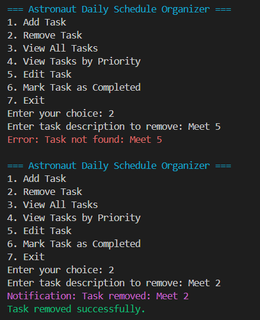

# Astronaut Daily Schedule Organizer

## Overview

The Astronaut Daily Schedule Organizer is a console-based application designed to help astronauts manage their daily tasks efficiently. This application allows users to add, remove, view, and manage tasks with specific time slots and priority levels.

## Features

- Add new tasks with description, start time, end time, and priority level
- Remove existing tasks
- View all tasks sorted by start time
- Validate task conflicts (no overlapping tasks)
- Provide error messages for invalid operations
- Edit existing tasks
- Mark tasks as completed
- View tasks by priority level

## Technical Details

- Language: Java
- Design Patterns:
  - Singleton Pattern: Used for the ScheduleManager class
  - Factory Pattern: Implemented in the TaskFactory class
  - Observer Pattern: Used for notifying users of task conflicts or updates

## Setup and Installation

- Clone the repository:
   ```bash
   git clone https://github.com/Smith0212/Educational-initiatives-Assignment-
   ```

## Usage

Run the main application file:
```bash
cd ".\New folder"
```
```bash
javac com/astronautscheduler/astronautscheduler.java
```
```bash
java com.astronautscheduler.astronautscheduler
```

## Screenshots

### Add Task


### View All Tasks


### Remove Task



### Task Conflict Error Handling


### Edit Task


### Mark Task as Completed


### View Tasks by Priority


## Error Handling

The application includes robust error handling to manage:
- Task conflicts
- Non-existent task operations

## Logging

A logging mechanism is implemented to track application usage and errors.

